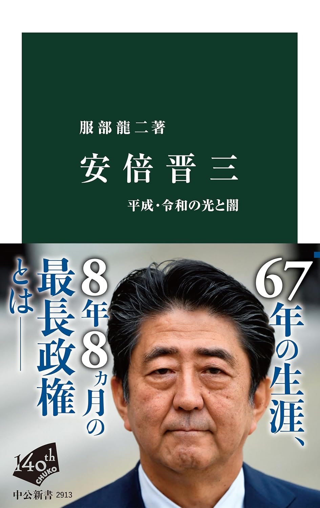
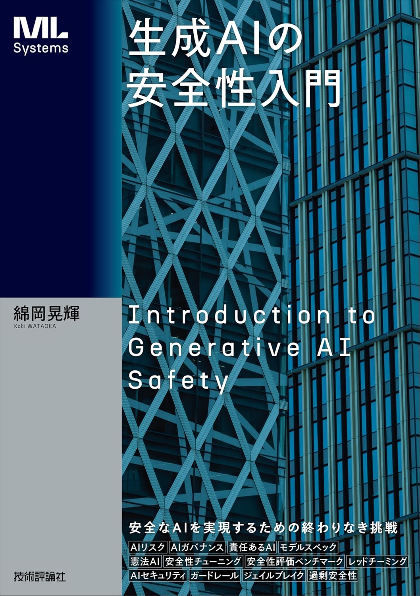
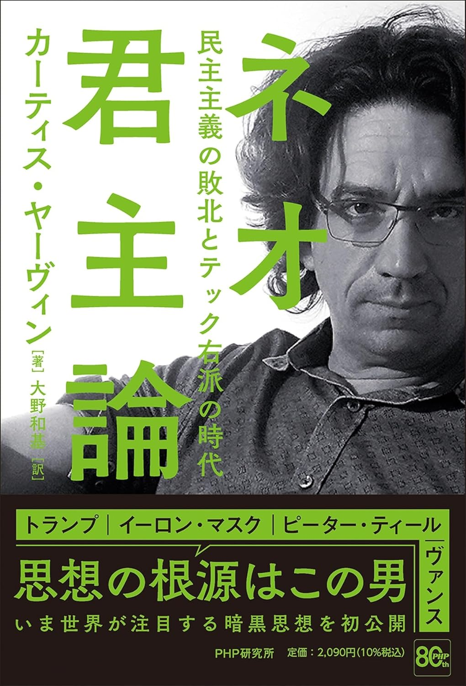
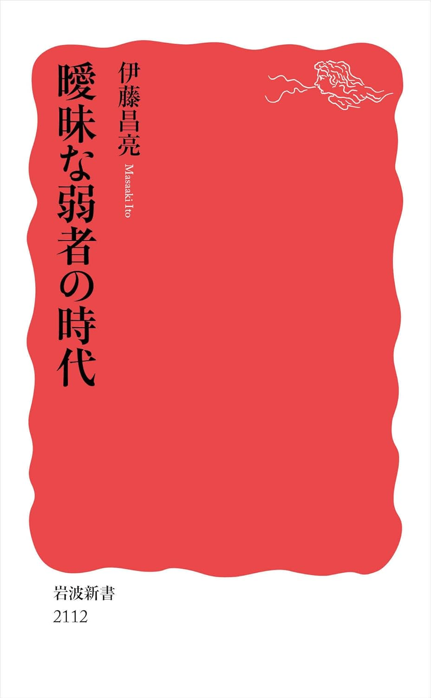
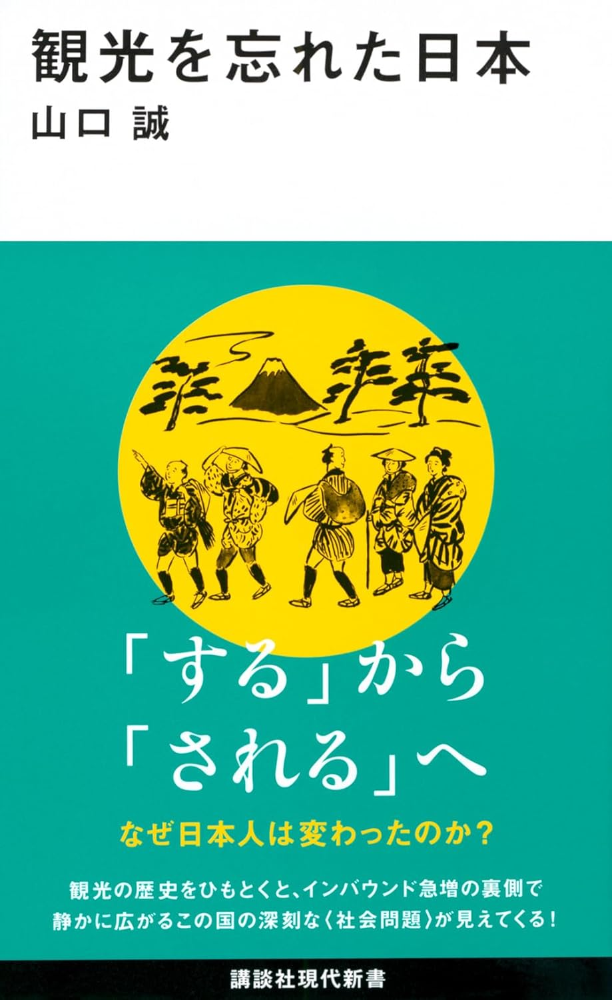

---  
title: "Readingmemo: Jun. 2026"  
date: 2026-07-01  
category: "Book"
og_image: images/readingmemo202606/readingmemo202606.png
---
## 安倍晋三
著：服部龍二／出版：中央公論新社

{: .cover}

あらかじめ言っておくと、僕は安倍晋三個人については否定的だが、政策については一定評価している（主に安全保障・外交）。しかし、安倍晋三個人への否定的な感情から、そのことさえ、認めることに抵抗を持ち続けていた。

同氏が亡くなってから、両翼から毀誉褒貶が飛び交った。一部の理性を失った左派は勢いでテロリストの生き様を描いた映画を制作し、同じく理性を失った右派と自民党は「国葬」を強行した。それほどまでに両翼に対して強い影響力とインパクトのあった政治家であったことは間違いないだろう。しかし、そうした熱狂のせいで、これまで客観的に、あるいは単に”冷静に”その業績について評価されてこなかった側面もあるだろう。

本書は同氏の生い立ちから第一次政権、第二次政権とその後に同氏が何をしたのか（できなかったのか）、それはどのような影響を及ぼしたのかを比較的中立的な書きぶりでまとめている。

同氏は亡くなったが、同氏の”置き土産”とも言える政策は無数に存在する。それを維持するも、変更するも、今とこれからの政権、そして託す国民にかかっている。まずは少し冷静になって、同氏が何者だったのか考えてみたい。

## 生成AIの安全性入門
著：綿岡晃輝／出版：技術評論社

{: .cover}

タイトルの通り、生成AIの安全性について体系的にまとめられた入門書。入門書と言って舐めてかかるとその内容の濃さに疲れてしまうくらい。骨太の入門書。

そもそも生成AIのはらむリスクとは何かがまずはまとめられる。情報漏洩とか偽情報だけかなと思っていたら精神的依存も当然含まれていた。本格的だ。そして、そうしたリスクを理解したうえで、どのように安全性を評価するのか、そして安全性を向上するためにはどのような技術、取り組みができるのかがまとめられている。最後にはAIセーフティの未来についてまとめられている。

とりあえずまずは読んでみて欲しい。少なくとも産業側ではこれくらいのことは考えないといけないし、ファンシーなことを言いいたがる人も、これくらいのことはキャッチアップしておいて損はないのではないだろうか。

## ネオ君主論
著：カーティス・ヤーヴィン／出版：PHP研究所

{: .cover}

読んでいるのが苦痛でたまらない。こんなに不快な本は他にないのではないだろうか。想像の10倍は苦痛だ。文字も大きいし、行間も広い。自己啓発書かと思ってしまった。

しかし、この本が「どう読まれているか」を考えれば、自己啓発書という側面は否めない。むしろそのように読んだほうが精神的にはいいのかもしれない。

DOGEの創設や彼らがやろうとしていたことを考えると、ヤーヴィンの影響力の大きさを感じるが、日本ではどうだろうか。明治や対象の教養人は日本の哲学のなさを嘆いた側面があるけど、実際そうなんだろう。官邸にはずっと胡散臭いエセ学者やエセジャーナリストやらがうろちょろしている有様だ。

そういう日本のグロテスクな状況を見ると、米国のこういう「ブログ思想」が盛んでかつ、それが社会を動かすまでになっているのは反面、羨ましくもある。

それでも僕はテック右派は基本的にcrazyだと思っているので”テック左派”としてもうちょっと真面目に生きねばなと思った。

## 曖昧な弱者の時代
著：伊藤昌亮／出版：岩波書店

{: .cover}

「ひろゆき論」で話題を集めたメディア研究者の伊藤さんの新刊。伊藤さんの論考で特に面白いのは参政党についての分析。参政党は土地は守るが、空は守らないという。外国人による土地取得規制や、入国規制などには積極的なのに、気候変動対策、脱炭素など、大気には関心がないというもの。

それ以外にも財務省解体デモや、石丸現象など、なんとも形容詞がたい、不可解な現象に「弱者」という概念を導入して分析を行なっている。

男性中心の社会では女性の権利についてあまりに軽視されているが、その反動もあってかJ-フェミニズムには内在的にミサンドリーを抱えているように思う。この本ではその視点の交差が1つのポイントのように思う。

## 観光を忘れた日本
著：山口誠／出版：講談社

{: .cover}

パスポート取得率の低下や、国外旅行の減少などが叫ばれて久しいが、そもそも観光とはなんだろう？という問いから始まり、日本における観光需要と近年のインバウントの盛り上がりの影で、「観光を忘れた」という問題設定を行う1冊。

大学院の指導教員が観光研究にそのルーツの1つを持っていたこともあって、かなり面白く読んだ。そもそも観光というもの自体が政策的なモチベーションを持って生まれたこと、団体旅行や有給休暇の誕生もそれと関係して生まれたこととその歴史が面白かった。

新書にどこまで求めるのか問題はあるが、かなり観光学あるいは観光社会学における研究の蓄積がまとめられていて初学者には面白いのではないだろうか。