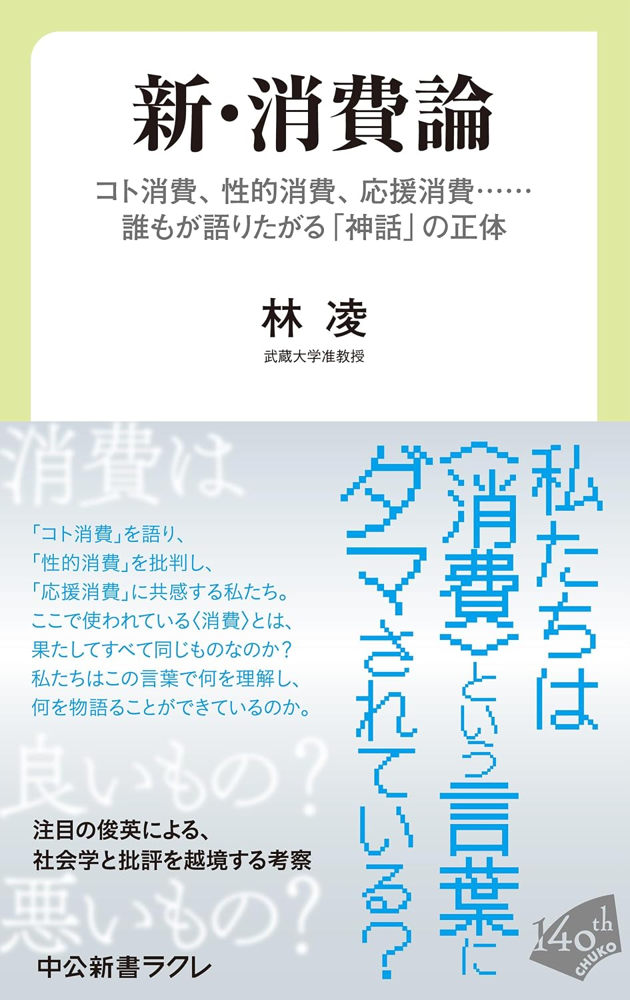
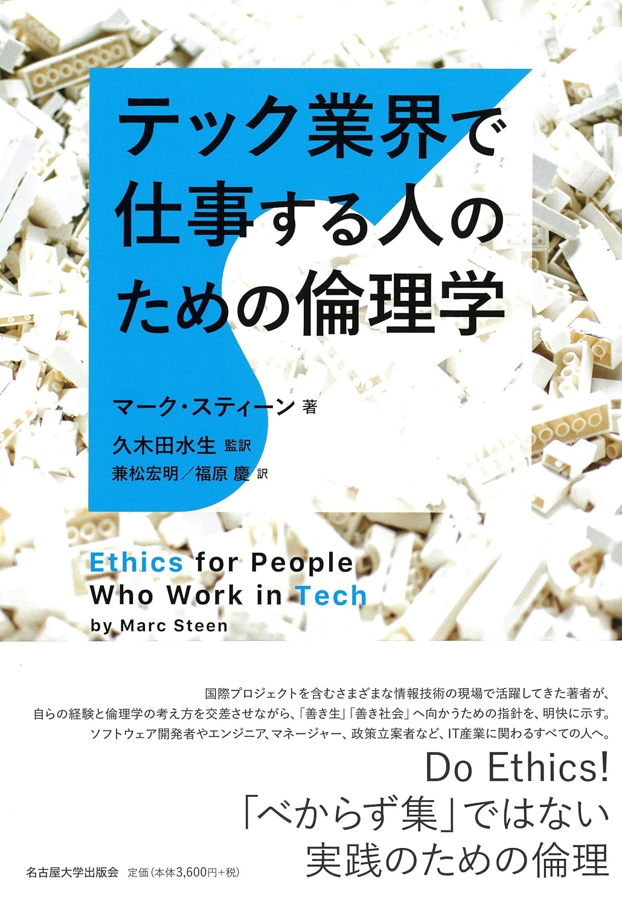
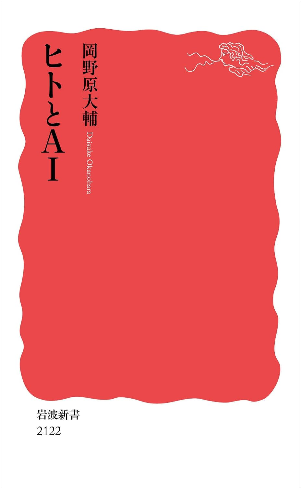

---  
title: "Readingmemo: Jul. 2026"  
date: 2026-08-02
category: "Book"
og_image: images/readingmemo202607/readingmemo202607.png 
---
## 夏帆
著：村上春樹／出版：新潮社

 {: .cover}

待ってました。村上春樹の最新作。発売当日にオフィスのあるビルに入っている書店で購入。1日机の上に飾ってその週末と翌週末に分けてじっくり楽しんだ。

既に多くの場所で多くの人に語られている作品なのでわざわざここで何かを言う必要はないが、村上作品の面白さはその世界観になることを痛感した。

突然ブスだ何だと罵倒したかと思いきや、個人的にも思い入れのある中央線沿線がdisられ、こちらが「やれやれ」という気持ちになったかと思えば、突然アリクイが喋り始める。それでもある種の「論理性」はそこに一貫してあるし、全く何の違和感もなく、その作品世界の中で妙な緊張を覚える。やはり村上春樹という感じだ。

そして、今作は初めて女性が主人公として描かれていた。これまでの父-息子の物語から一転し、母-娘の物語へと変わっている。父-息子と同じ物語構成ではない。これまでの作品ではより明確に描かれていた息子の父への憎悪や嫌悪感は所与のものではなく、本作では物語が進むことにその微妙な輪郭が徐々に浮かんでくる。

結末については諸説あるだろうが、村上春樹という偉大な作家が生き、そしてそれを楽しめる時代に生まれたことへの喜びが止まらない。

## AIに恋しちゃダメですか？
著：清水颯／出版：技術評論社

 {: .cover}

タイトルで油断させておいて、中身の重厚さでやられる。そんな1冊。若手の気鋭研究者の清水さんが書く、哲学入門書であり、AI倫理の入門書と言ってもいいかもしれない。それだけ本の中で展開される議論はアカデミックなものだ。まず、タイトルと表紙で躊躇している人がまだいるなら、今これを読んだ瞬間に買って欲しい。

その上で、本書が面白いのは今浮かび上がっているAIと人間をめぐる問題に対して、これまで何が議論されてきているのか、そして過去の哲学者はどのように議論してきたのか、の2点を同時に学べる点だ。

例えば、AIに対する「愛」的な感情は「愛」と呼べるのか、はたまた異なるものなのか。この問いに対して、批判派・擁護派双方の主張を丁寧に掘り下げながら、その問題設定自体が抱える困難を指摘し、バランスを導入する。

既にAIに恋してしまっている人も、そうでない人も楽しめる1冊だ。

## 新・消費論
著：林凌／出版：中央公論新社

 {: .cover}

消費者研究で知られる林先生の新刊。前回は骨太な研究書であったが、今回は比較的読みやすい新書で発売。しかし、その内容は決して軽くはない（だからこそ面白いのだが）。

議論の対象となっているのは、「〇〇消費」という形で語られる言説だ。本書では、「コト消費」、「性的消費」、「応援消費」がその対象に挙げられている。少し考えてみれば分かるように、軽薄なマーケターによって作られたこれらの概念は軽薄だ。その特徴の一部を抽象化し、耳馴染みのいい概念として多用する。

しかし、ここに罠がある。使いやすいから使ってしまうのだ。そうした軽薄な言葉に積み重ねられてしまった”歴史”をたどりながらその起源を探求し、なぜこれらの語が使われ続けるのか、その正体を探りにいく。

大学生が読めば、方法論の簡単なテキストとしても参照できるだろうし、その他の疲れた労働者にはアルコールのような、多量に摂取すれば毒だが、少量なら…という快楽剤になるだろう。

## テック業界で仕事する人のための倫理学
著：マーク・スティーン／出版：名古屋大学出版会

 {: .cover}

名古屋大学出版会の本は大体どれも面白そうだけど、大体がそれなりの値段をするためなかなか手が出せない。しかし、この本は名古屋大学出版会の中では安い部類だ（それでも安くはないが）。そんな、タイトルから既に刺激的な1冊が、この『テック業界で仕事する人のための倫理学』だ。

僕はドンピシャで読むべき人の部類に入るので当然のように読んだわけだが、これはもう少し広く、最近「令和人文主義」や「テクノロジカルリパブリック」ブームでヘラヘラしているビジネスパーソンは読んだらいいんじゃないだろうか。「倫理を考えることとは何か」を考えるための思考法やフレームワークが本書では紹介されている。そして丁寧に実践する方法まで紹介されている。

この本をトリガーに、もう少し人文的な知の難しさ（単純化できなさ）を身体的に理解した上で、立場を作っていくといいんじゃないだろうか。そんな示唆が得られる1冊。

## ヒトとAI
著：岡野原大輔／出版：岩波書店

 {: .cover}

日本を代表するAI企業の1つ、Preferred Networksの共同創業者で社長の岡野原大輔さんによる「人間-AI論」。

詳細は[このブログ](https://yutaro0518.com/blog/booklog_okanohara)でも紹介しているが、比較的保守的な人間-AI観が展開されている。AIの道具性が強調され、責任を引き受ける主体としての人間が提示される。

僕は昔から、政治家・性労働者という職業はどんなにAIの社会実装が進んでもなくならない職業だと思っている。どちらも人間であるということに価値がある職業だからだ。（それ自体の賛否はもちろんあるだろうが）政治家の最も重要な仕事は、御用聞きとしてひたすらクレイムを聞いて回り、有権者に「議員先生に言ってやった」という快楽と、問題が解決に向かう希望を抱かせることになると思う。そして、性労働者も同様に、日に日に社会的に人権を失わされている「弱者男性」が貨幣というメディアを介すことで、性的な欲求を解消できるという希望を抱かせ続けることにあると思う。

そういう意味で、「責任の引き受け」という観点は新鮮だった。しかし、まともに責任を引き受けられている人間（管理職）はどれだけいるだろうか。偉そうにAI時代の労働者の未来とかなんとか言っているそこそこのポジションにいる人間にこそ、その”人間性”が問われるようだ。
