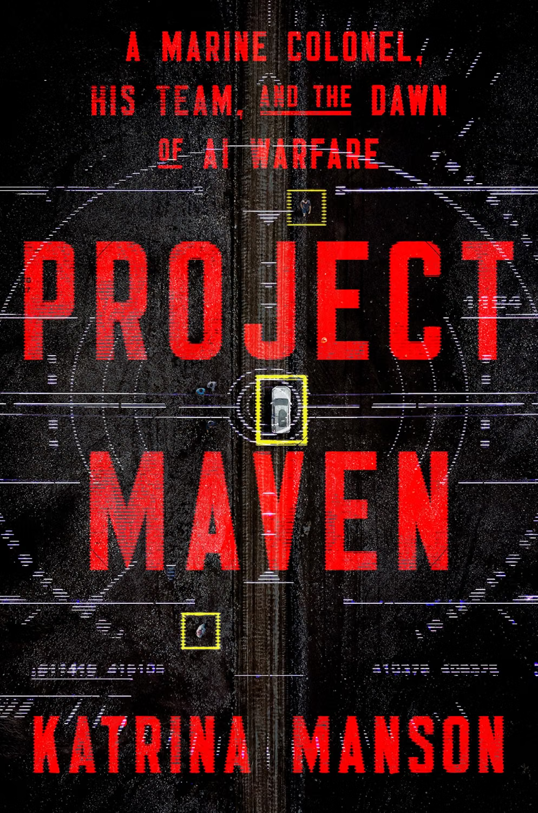
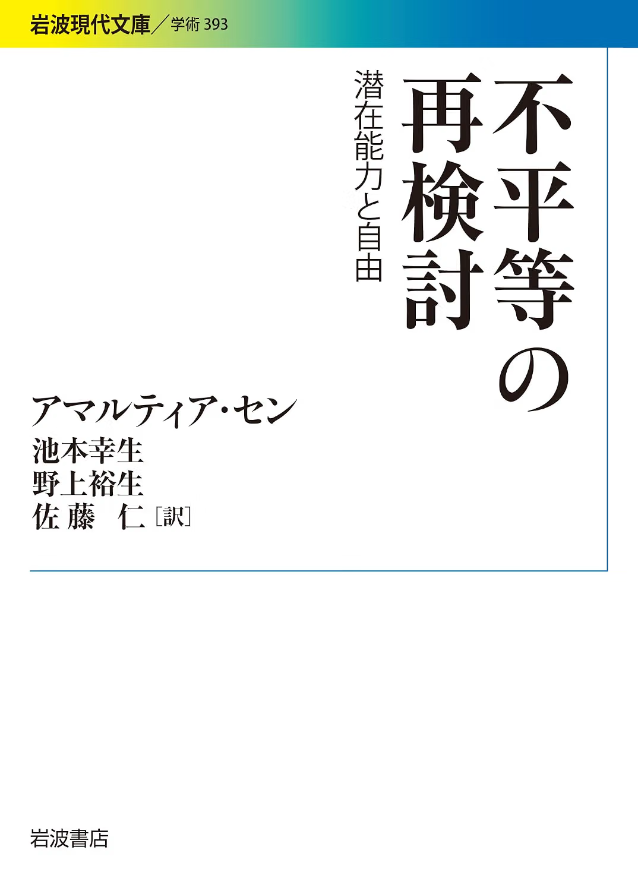
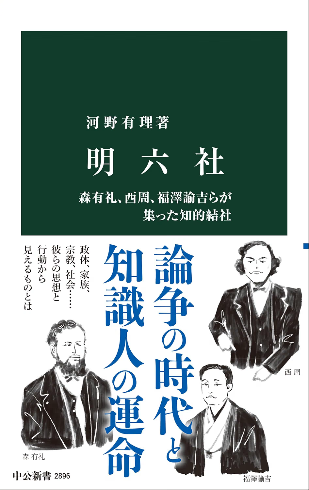

## Project Maven
著：Katrina Manson／出版：W W Norton&Co Inc.

{: .cover}

最近日本でも話題のPalantirが開発したことで知られるMaven Smart System(MSS)がどのようにして国防総省に導入されるに至ったのか、そしてMSSが戦場をどう変えているのか、100人以上へのインタビューやBloomberg記者の著者による取材に基づいて書かれた1冊。

『テクノロジカル・リパブリック』を読むなら当然こちらも読まないとだめだと思っている。むしろそれだけで満足しているのはただのファンですよ。いかに彼らの背後に米軍（海兵隊）の思惑があったのか、そしてGenAI時代以前からこうした取り組みが進められていたのかという背景史が興味深いのはもちろん、戦場にAIが組み込まれることの倫理的問題についても浮き彫りにしている。

日本でも全く同じことをやればいい！とは色々な意味でいかない。リアルウォーデータはないし（幸運なことに）、Mythosで分かったように、フロンティアモデルへのアクセスが常にセキュアなわけでもない。しかし一方で、米中が急速にAIの実装をインダストリーに限らず、軍事面でも進めている中で、全くキャッチアップしないことももはや選択肢にはない。そうした難しい状況の中にいることを自覚し、議論するための情報提供と知識のインプット、そして言論が必要な局面にあることを実感する。

## 日本政治思想
著：松沢弘陽／出版：岩波書店

{: .cover}

松沢弘陽氏の放送大学での授業を元にしたテクスト。帯にも書いているが、日本における「思想の不在」を憂い、そして問題意識を持ち、「日本政治思想」を確立するために奮闘した思想家の”思想”とその系譜が丁寧かつ、分かりやすくまとめられている1冊。

恥ずかしながら、僕もまだまだ「日本の思想」に対する理解が浅いどころか、ほとんど知らなかったことを痛感した。特に明治啓蒙思想というのについては目から鱗だった。

少し引いて考えると、その原因は義務教育を真剣に受けなかったこと、高校で海外に出てしまったことという真面目な要因に加えて、「福沢諭吉-慶應嫌い」という個人的な動機が十二分にあることに気づいてしまった。福沢諭吉の功績については、後に紹介する『明六社』でも思い知ることになるが、だからこそより、「慶應的なもの」への不快感が増すのであった。

しかし、こうして大正・明治期の思想家の格闘とその成果によって現代の日本社会があることは確かである。桑田佳祐は「教科書は現代史をやる前に時間切れ」と唄うが、それは何も、江戸時代以降の（特に侵略の）歴史に限らず、言論をめぐる動向についても同じなのかもしれない。

そして、AIの浸透によって、今、人間観が再び問われている。この本で紹介されている思想家以外にも、日本には同じく「哲学の不在」を憂いた京都学派の歴史が存在する。そうした「日本的知」から今、何が言えるのか、もう少し考えてみたい。

## 不平等の再検討
著：アマルティア・セン／出版：岩波書店

{: .cover}

人間の能力って何だろう、能力に応じてできることもあれば、できないこともあるよなみたいなことを考えていた時に、ちゃんと読まねばということで改めて手に取った1冊。

アマルティア・センは解説する必要ないくらい有名人だとは思いつつも、センは経済政策を地域の福祉への効果で考える厚生経済学の功績でノーベル経済学賞を受賞したインド出身の経済学者（哲学者）。ただし、この本でも扱われている、「ケイパビリティ・アプローチ」の方が一般的にはより有名な気がしている。

ケイパビリティ・アプローチは、功利主義の功利の平等、ロールズ的な基本財の平等でもなく、ご飯が食べられているなどの機能のうち、どの程度選び取れているか（ケイパビリティ）に注目するという考え方。UNDPの人間開発指標（HDI）とも（最終的には）アラインしながら、このケイパビリティに基づいた不平等、貧困の発見に貢献した。

一番面白いのは、何をもって不平等とするかという点だ。最近でも大学入試における女子枠の平等性についての議論が絶えないが、これもまた、「誰の」、「何の」不平等なのか、合意形成に失敗しているからだろう。そしてセンがケイパビリティに注目したのは、ある人間が「貧困」にあるかどうかは単純な経済指標では測りきれない多様性を認めていたからだ。だからこそ、ある状態からどれだけ剥奪されているのかに注目した。

我々はどうしても、西洋の知をありがたがるところがあるが、アジアにも優れた知識人が多く存在することを忘れがちだ。

## 明六社
著：河野有理／出版：中央公論新社

{: .cover}

日本政治思想でも言及されていた福沢諭吉について、そして明六社について理解しておきたいなと思って手に取った1冊。

通っていた大学院には森有礼高等教育国際流動化機構なる、全く何をしているか分からない組織があった。しかし、それとは反対に明六社が何で、そのコアメンバーらがどのような思想の構想に励んでいたのかが分かりやすくまとまっていた。

とくに印象的だったのは、アソシエーションに行き着いたということだった。今でこそ、何かあれば組織を組んである課題のために取り組むことは当たり前だが近代化の幕開けであった明治期にこうした人々がいたのはある意味で新鮮だった。そして同じようなことを100年経ってもやっている人が絶えないことを見ると、日本人の精神性、あるいは人間の普遍性なのかもしれない。

## 海辺のカフカ
著：村上春樹／出版：新潮社

{: .cover}

ちょっとプライベートで悲しいことがあったので逃避も兼ねて『海辺のカフカ』に。僕のジェンダーにかかわらず年上の方が好きな感じがこの本を読むと手に取るような実感として振ってくる。とくにさくら。完全に「カフカくん」って呼ばれたいだけ。

でも、この本がエディプス王の話をリファーしているように、僕の生育環境とかそれにまつわる主観的な記憶とか、そういうものが絡んでいる気がずっとしている。例えば中学くらいからずっと父親とは仲が悪かったから「兄貴」的なもの、「父親」的なものをずっと求めているんだろうし、割に俯瞰で色々感じられてしまうので主観と、それをななめに見る視点の両方が常にあって、だからこそななめに見るダサさを斬って、それで受け入れてくれる誰かをずっと探しているんだと思う（実際、若林正恭の『ナナメの夕暮れ』でもそういう描写は多かった）。

その意味で、毎年7・8月の風物詩、『1Q84』とは違って、本当に弱っている時に読んで、甘えたい自分を存分に自分自身に知らしめるための本。助けてください。