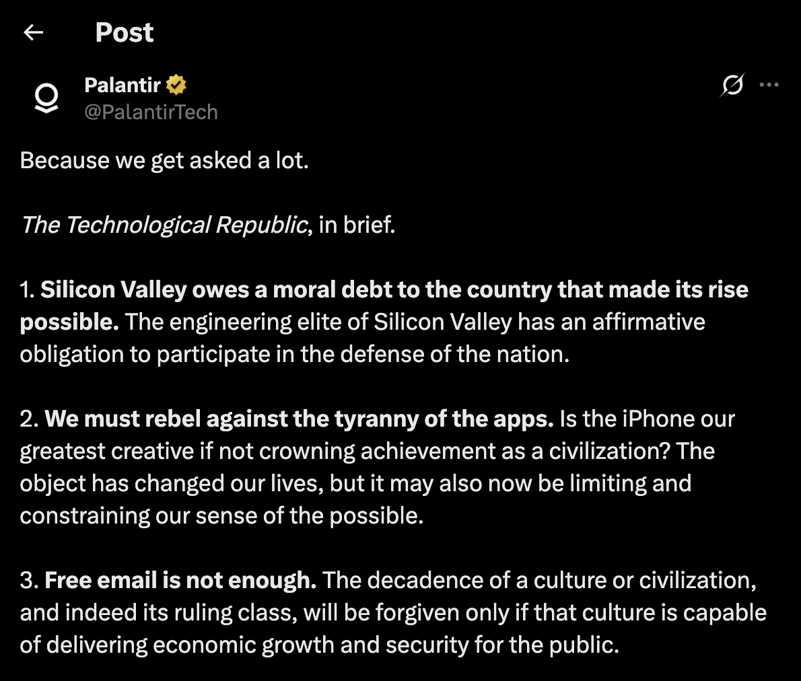
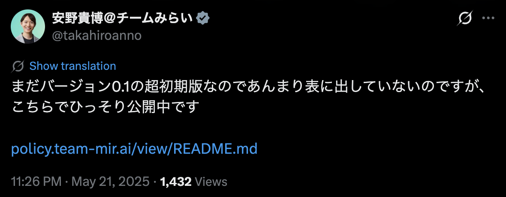
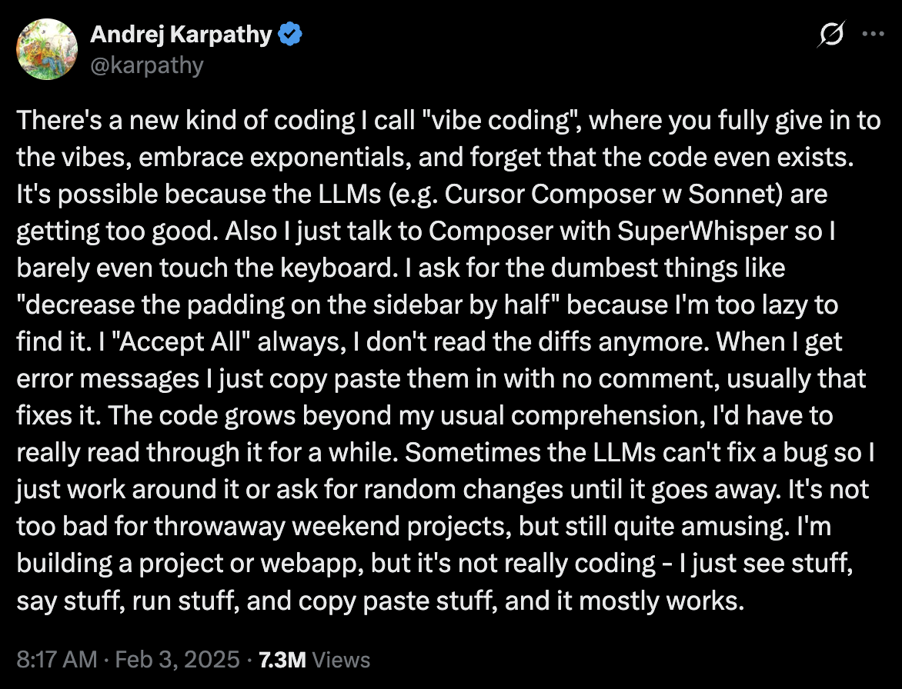

2026年上半期、世界の議論を動かしたテキストを思い出してほしい。国連の報告書でも査読誌の論文でも新聞の一面でもない。1月26日に個人サイトに載った約2万語のエッセイ、2月26日に企業サイトに出た声明、4月19日に企業アカウントが投稿した22項目の箇条書き。この3つのほうが、はるかに多くの議論を動かした。

いま世界を動かしている一次資料はblogである。そしてその告知と応酬を担うのがTweetだ。長文が世界観を運び、短文がタイミングを運ぶ。この分業が報道・査読・立法といった既存の制度よりも速く回っているために、議題設定の実権がそちらに移りつつある。このエッセイでは、今世界をblogが動かしていることを示した上で、何が起きているのかを理解することを試みたい。

## なぜ今、blogなのか

### 1本のエッセイが議題を設定する

Anthropic CEOのDario Amodeiは、2026年1月26日、個人サイトに「[The Adolescence of Technology](https://darioamodei.com/essay/the-adolescence-of-technology)」を公開した。約2万語。人類が技術の思春期に入りつつあるという主題で、国家安全保障、経済、民主主義への影響を並べ、AIが「我々が種として何者であるかを試す」と書いた。ダボス会議の直後というタイミングだった。告知のTweetは580万回以上表示され、翌日には[Fortuneが論評記事](https://fortune.com/2026/01/27/anthropic-ceo-dario-amodei-essay-warning-ai-adolescence-test-humanity-risks-remedies/)を出した。査読も編集も経ていないテキストが、その週の業界最大のトピックになった。

これは偶然ではない。2024年10月の「[Machines of Loving Grace](https://darioamodei.com/essay/machines-of-loving-grace)」は、AIによって数十年分の科学的進歩が圧縮されるというナラティブを業界に定着させた。2026年6月の「[Policy on the AI Exponential](https://darioamodei.com/post/policy-on-the-ai-exponential)」は、AIの能力が指数関数的に伸びる一方で政策は伝統的な速度でしか動かないという時間のずれを主題に据え、フロンティアモデルの事前テストや労働市場への影響の計測を提言した。皮肉にも、このエッセイの公開から数日後、Anthropicの最上位モデルは米国の輸出管理措置で一時的に提供停止となり、7月に復旧している。政策論争の議題がblogの上で提示され、それに政府が現実の手段で応答するという回路が、すでに動いている。

OpenAIのSam Altmanはもっと長くこれを続けている。blogを始めたのは2013年、Y Combinator時代だ。直近の「[The Gentle Singularity](https://blog.samaltman.com/the-gentle-singularity)」（2025年6月）は2000語程度で、「我々はすでに事象の地平線を越えた」という一文から始まる。ここで注目すべきは修辞ではなく機能だ。彼はこの記事で、2025年に認知労働をこなすエージェントが到来し、2026年には新しい洞察を生むシステムが現れ、2027年には現実世界で作業するロボットが来る、と年次で書いた。エッセイの形をとった製品ロードマップの予告であり、メディアと投資家は実際にそう読んだ。決算説明会でも記者会見でもなく、個人blogが企業戦略の一次資料として機能している。

### blogが効く3つの理由

なぜこの形式が効くのか。理由は3つある。媒介の消失、長文による世界観の提示、そして公開までの速度だ。

第1に、媒介が消える。記者会見なら記者のフィルターが入り、プレスリリースなら広報の定型に落ちる。blogは書いた本人の署名入りテキストがそのまま世界に出るため、引用も検証も反論も同一のテキストに対して行える。

第2に、長文なら世界観まで提示できる。Tweetは主張しかできないが、2万語のエッセイなら、なぜそう考えるのかという前提や、想定される反論への応答まで書ける。AIの未来のように不確実性が高い主題では、結論そのものより、どういう前提でそう考えているかのほうが情報量が大きい。しかも署名入りで書かれるため、読み手はそれを書き手が構築した1つのナラティブとして受け取る。

第3に、公開までの速度がある。査読は数ヶ月から数年、立法は数年、国際的な枠組みはそれ以上かかるが、blogは即日で出せる。技術の進歩速度に間に合う唯一の形式が、いまのところblogしかない。制度の怠慢ではなく構造の問題であり、だから速い側は自分でテキストを出すしかない。

### 企業のblogは「発表の場」から「検証のインフラ」へ

企業の側を見ると、この構造はさらに明確になる。企業におけるblogの役割が変化しているのだ。

現在のAIブームの起点はblogの記事1本だ。2022年11月30日、OpenAIは「[Introducing ChatGPT](https://openai.com/index/chatgpt/)」という研究blogの投稿を出した。派手な発表会もなかった。あの一本が世界を変えた。以後OpenAIは、モデルの振る舞いの規範を定めたModel Spec、リスク評価の枠組みであるPreparedness Frameworkといった、本来なら規制文書に相当する内容までblogで公開している。

Anthropicも同様だ。Core Views on AI Safety、Responsible Scaling Policy、解釈可能性研究の解説記事。2026年2月26日には、米国内の大規模監視と完全自律型の致死的機能を契約から除外すると自社サイトで公表した。注目すべきはこれへの国防省側の応答形式だ。国防長官はTwitterに投稿し、国防省は取材に対してそのTweetへのリンクを提示した。国家と企業の交渉が、公開されたblogとTweetの上で進行した。翌27日には政府が同社を安全保障上のサプライチェーン・リスクに指定し、3月には同社が政権を提訴している。並行してOpenAIは2月28日に「Our agreement with the Department of War」という記事で、自社が交渉した歯止めの内容を列挙した。企業と国家の安全保障上の取り決めが、blogの記事として並んでいる。

国内でもこの文化は根付いている。Sakana AIは論文と、それ以外のテーマについてもblogで紹介している。Evolutionary Model Merge（2024年3月）、The AI Scientist（2024年8月）に続き、2026年6月には自律型リサーチアシスタントのSakana Marlin、オーケストレーションモデルのSakana Fugu、監査法人と共同開発したLLMエージェント評価環境CoffeeBench、7月には物理ブロック上でニューラル・セルオートマトンを走らせる研究を発信している。

もう1つ、blogという形式の性質がよく見える事例がある。2025年1月20日、DeepSeekは推論モデルR1を、論文とMITライセンスの重みとともに公開した。1月27日、Nvidia株は17%前後下落し、1日の時価総額の減少額としては米国市場史上最大となった。学習コストが560万ドルだったという数字が、巨額の設備投資を前提としてきた業界の常識を揺さぶったからだ。

同じ数日のうちに、検証がblogとTwitter上で始まった。研究者たちは、560万ドルは最終的な学習にかかった計算費用だけを指し、ハードウェアの調達も研究者の人件費も電力も含まないと指摘し、SemiAnalysisは総投資額の推計を公開した。数字の解釈は1週間ほどで修正された。バークレーの研究者はR1-Zeroの中核挙動を小さなモデルで再現し、30ドル未満でできたとTwitterに投稿した。Hugging Faceは公開から数日でOpen-R1を立ち上げ、伏せられていた学習データと手順を埋めて完全な再現を目指す計画をGitHubで宣言し、進捗を逐次公開した（第1段階の完了は同年5月）。査読誌の検証なら数ヶ月から年単位かかるものが、ここでは数日で走った。企業のblogはもはや発表の場ではなく、検証と反論と訂正が起きるインフラになっている。

### 「blogは新しくない」という反論

blogという形式そのものは新しくない。新しいのは、それを誰が書いているかだ。

Pyra Labsが[Blogger](https://www.blogger.com/)を公開したのは1999年8月、Ben Trottらの[Movable Type](https://www.movabletype.org/)のバージョン1.0が公開されたのは2001年10月、Matt MullenwegとMike Littleが[WordPress](https://wordpress.org/)の最初のバージョンを公開したのは2003年5月である。Paul Grahamが自身のサイトでエッセイを公開し始めたのも2001年だった。形式としてのblogは、20年以上前に完成している。

変わったのは書き手の権力だ。かつてblogを書いていたのは、影響力を求める外部の観察者だった。いまblogを書いているのは、数十兆円規模の資本を動かし、国家安全保障の調達に食い込み、労働市場の見通しを左右する企業の意思決定者である。Marc Andreessenが「Techno-Optimist Manifesto」を出したのは2023年、Leopold Aschenbrennerが165ページの「Situational Awareness」を自費で公開したのは2024年だった。同じ形式でも、書き手が変われば効果は変わる。「blogの時代」が指すのは形式の新しさではなく、権力がこの形式を主要な発表手段として選んだという事実だ。

## 短文が運ぶのはタイミングである

blogが世界観を運ぶのに対し、Tweetが運ぶのはタイミングだ。そして、タイミングには値段がつく。

2025年4月9日午前9時37分（米東部時間）、ドナルド・トランプはTruth Socialに「THIS IS A GREAT TIME TO BUY!!! DJT」と投稿した。約4時間後、彼は関税の90日間停止を発表した。S&P500はその日9.5%上昇し、Nasdaqは12%上げ、直前4営業日で失われた価値の約4兆ドル、7割近くが戻った。戦後有数の一日の上昇である。2026年に公開された資産開示では、前日の4月8日に彼が327件の株式購入を行っていたことも明らかになった。政策の発表媒体が自社SNSの投稿であるという制度上の事件と、その投稿の数時間の前後関係が金融的な意味を持つという市場上の事件が、同時に起きている。

同年6月5日には、イーロン・マスクがTwitter上で歳出法案を「嫌悪すべき愚行」と呼び、トランプがTruth Socialでマスクの運営する企業への政府契約打ち切りに言及した。2人は別々のプラットフォームで応酬した。その日、テスラ株は14%以上下落し、時価総額は約1520億ドル失われて1兆ドルを割り込んだ。同社史上最大の1日の下落である。

マスクの場合、この構造はもっと古い。2018年、非公開化を検討しており資金は確保済みだとした投稿が証券詐欺の訴えを招き、彼と会社はそれぞれ2000万ドルの和解金を払い、彼は会長職を降りた。2020年には自社株が高すぎると投稿し、実際に株価を急落させた。投稿が証券規制の対象になるという事態は、十数年前の制度設計には存在しなかった。

### 書籍の綱領がTweetになる

ここまでは、長文はblog、短文はTweetという区別で見てきたが、その境界を壊す事例も出てきている。

2026年4月19日、Palantirの公式Twitterアカウントが、CEOのAlex Karpと同社Nicholas Zamiskaによる著書『The Technological Republic』の要点を22項目にまとめた投稿を出した。出版から1年の節目である。内容は兵役の復活の主張、第二次大戦後の秩序への評価、AI兵器、宗教と権力、シリコンバレーが暴力犯罪に対して果たすべき役割にまで及ぶ。マニフェストと呼ばれ、広く批判された。批判の中心は思想の内容だけではない。哲学者のMark Coeckelberghは、政党や政府が政治的ビジョンを競うのは当然だが、国家の安全保障や監視に深く組み込まれた私企業がそれをやることは別の問題だと書いた。選挙も経ず、公衆に対する説明責任も負わない主体が、政治的綱領を掲げている。

書籍という制度には編集者がいて、出版社の判断があり、書評という事後の検証がある。今回起きたのは、その本の要約が著者たちの側から編集を経ずに一次資料として投げ出されたことだ。ある批評家は皮肉として「あの本はTweetで済んだはずだ」と書いていたが、実際にTweetになった。書籍が担っていた綱領の機能を、SNSの投稿が引き受けている。

### 日本では政策文書がGitHubに載った

日本にも似た事例がある。

安野貴博は2024年の東京都知事選で、マニフェストをGitHubのリポジトリとして公開し、Issue（課題提起）とPull Request（変更提案）を有権者から受け付けた。2025年に新党チームみらいを立ち上げると、参院選前に「バージョン0.1（超初期版）を批判覚悟で公開します」とTwitterで宣言し、議論の途中のマニフェストを出した。AIが有権者から話を聞き取り、そのままGitHubへ変更提案を送る「しゃべれるマニフェスト」を通じて、1300件を超える提案が集まった。7月の参院選で比例代表から当選し、政党要件を満たした。

政策文書の存在形式が変わった。完成品として発表される公約から、更新履歴のあるテキストへ。バージョン番号がつき、誰がいつ何を変えたのかが追跡でき、外部から差分を提案できる。ソフトウェア開発の作法であり、同時にblog文化の作法でもある。書いて出す、批判を受ける、直す。この回転を政治が採用したとき、それは選挙で議席になった。

もう1つ、Tweetが世界の語彙そのものを変えた例がある。2025年2月2日、Andrej KarpathyがTwitterに、新しいプログラミングの方法があって自分はそれをvibe codingと呼んでいる、と投稿した。450万回以上表示された。3月にはMerriam-Websterがトレンド語として掲載し、11月にはCollins辞典が2025年の言葉に選んだ。1つの投稿から9ヶ月で、産業が自分自身を語る語彙になった。定義や辞書のような、本来は制度が時間をかけて決めるものが、投稿から始まっている。

## 議題設定の実権が制度の外側へ移った

### 国家と企業が同じ媒体で応酬している

Anthropicと国防省の対立を思い出してほしい。企業側は自社サイトの声明を出し、国防長官はTwitterに投稿し、国防省は取材への回答としてそのTweetのリンクを渡した。企業と国家が、同じ形式、同じ速度、同じ公開性で応酬している。20年前なら記者会見と公聴会と業界紙のスクープで進行していたはずだ。国家と企業がともにblogとTweetを一次的な発表手段として選んでいる。Palantirが政治的綱領を投稿し、政治家がマニフェストをGitHubに置くのは、この対称性の別の現れにすぎない。

### 速度の非対称性が、実権を移動させた

なぜ両者が同じ媒体に収束するのか。答えは速度である。

Amodeiが指摘した通り、制度は動き出すのが遅い。立法には年単位、査読には月単位、報道にも編集の時間がかかる一方、モデルの世代は数ヶ月で更新される。この非対称性を埋める手段として、即日で出せて一次資料になり、全世界から検証を受けられる形式が選ばれた。

この移行は権力の移動を含む。何が重要な論点かを決める議題設定（アジェンダ・セッティング）の権限が、制度の外側にある高速レーンへと移った。

2026年前半にAI政策の争点になったのは、事前テスト、労働市場への影響の計測、市民的自由、民主主義国の連携だった。私の見るかぎり、いずれもまず個人のエッセイや企業のblogに現れ、その後に政府と議会が反応している。従来なら、公聴会や政府文書が論点を立て、企業や個人がそれに応答していた。いまはその順序が逆になっている。

### 説明責任は開かれ、同時に品質保証を失った

この変化には良い面がある。一次資料が誰にでも、どこからでも読めるという点だ。企業が何を約束したのか、CEOが何を予測したのか、政党が何を公約したのか、原文で確認できる。検証と反論も同じ場所で行える。DeepSeekの件で外部の研究者が数日で誤りを指摘できたのも、チームみらいのマニフェストに1300件の提案が届いたのも、同じ構造による。編集者を通さないというのは、誰でも編集に参加できるという意味でもある。

同時に、無視できない負の面がある。編集も査読も選挙も通っていないテキストが、制度的な文書と同じ重さで流通することだ。Palantirの22項目は誰にも承認されていない。トランプの「今が買い時」は、大統領による政策発表なのか個人の相場観なのか、その曖昧さのまま市場を動かした。速度と検証可能性を手に入れる代わりに、事前の品質保証を失っている。

### blogは、人間だけが読むものではなくなった

2000年代のblogと決定的に違う点がある。いまのblogは、人間だけが読むわけではない。

blogはモデルの学習データになり、検索とAIアシスタントが参照する一次資料になる。「Anthropicはどういう会社か」と尋ねられたAIは、Anthropicが書いたテキストを読んで答える。blogを書くという行為は、自分たちについての将来の記述の基礎を書くという行為になった。書かなければ、他人の要約が一次資料になる。

プレスリリースは配信された瞬間が本番だった。blogは、書かれた後にAIによって何度も読み直される。10年後に誰かがAIに質問したとき、その答えの根拠になる可能性がある。この非対称性を意識して書かれたテキストと、そうでないテキストは、長期的に全く違う仕事をする。

## だから、世界はblogで動いている

いま世界を動かしているのは、blogである。世界観と前提を運ぶのは長文であり、Tweetはその告知と応酬として、タイミングと定義を担う。どちらも既存の制度より速いが、中心にあるのは、書き手の世界観をまるごと載せられるblogのほうだ。

編集者も査読者もいない場所で、権力が自分の言葉で世界観を提示し、それが市場と政策を動かす。その環境で何を書くかは、書く技術の問題であると同時に、責任の問題だ。世界がblogで回っているなら、blogを書くことは、世界の回り方に関与することである。
