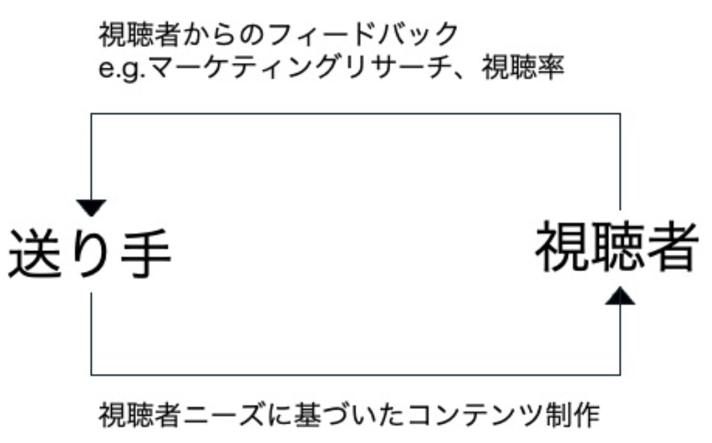
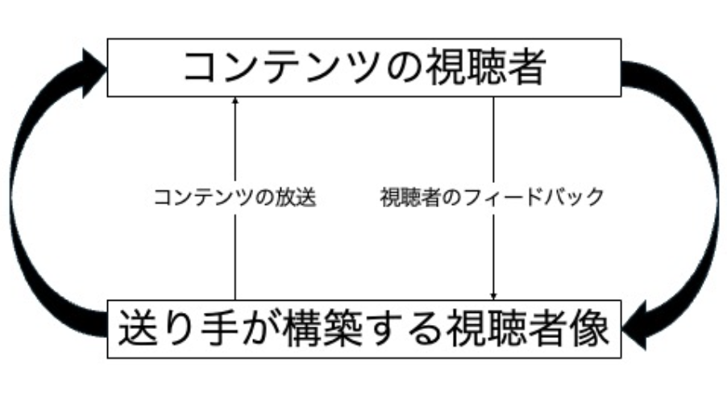

---  
title: "【Notes from the Thesis】第2回 パンダとグルメに負ける気候変動。ニュースルームの内側で何が起きているのか"  
date: 2026-07-31 
category: "Essay"
excerpt: "修士論文を元にしたBlogシリーズ第2弾"
---
## **ニュースは「選ばれて」いる**
[前回](https://yutaro0518.com/blog/masterthesis01)は、日本のテレビが猛暑や豪雨という現象を大量に報じながら、その原因である気候変動にはほとんど言及していないことをデータで確認した。今回は、なぜそうなるのかを、テレビ局で働く送り手たちへのインタビューをもとに考えたい。

前提として押さえておきたいのは、**ニュースは世界で起きたことの縮図ではない**、ということだ。世の中では毎日、無数の出来事が起きている。そのうちごく一部が記者によって原稿になり、デスクや編集長の判断で選別され、放送尺を与えられ、映像として編集され、アナウンサーの声で届けられる。私たちが夜のニュースで観ているのは、この長い選別と加工の工程を生き残った、いわば「構築されたリアリティ」である。

では、何が生き残り、何が落とされるのか。その判断基準がニュースバリューと呼ばれるものだ。インタビューからは、少なくとも7つの要素が浮かび上がった。（1）珍しさ、（2）情動の刺激、（3）固有名詞の知名度、（4）政治・経済的重要性、（5）速報性、（6）他社への横並び意識、そして（7）現場と編集部の間の交渉である。

この一覧を眺めると、気候変動というテーマの分の悪さがよくわかる。珍しくない。派手な感情を喚起しない。「気候変動」には有名人も有名企業もいない。今日報じなくても明日がある。他社も報じていない。ほぼすべての基準で不利なのだ。

しかし、話はそれだけでは終わらない。インタビューを重ねると、ニュースバリュー以前の、もっと根深い構造が見えてきた。

## **無関心の循環**
テレビ局は、番組ごとにマーケティング調査を行っている。この時間帯にテレビの前にいるのはどんな人たちで、何に関心があるのか。あるアナウンサー経験者は、番組の内容はそうした調査で把握した想定視聴者層の関心にかなり寄せて作られている、と説明してくれた。

視聴者のニーズに応える。一見、まっとうな企業努力である。しかしここには構造的な罠がある。

考えてみてほしい。テレビがある問題を報じなければ、視聴者はその問題を「今、世の中で問題になっていること」として認識しない。認識していない問題は、マーケティング調査で関心事として挙がらない。そして「視聴者の関心が低い」という調査結果を根拠に、テレビはその問題からさらに距離を取る。報じないから関心が生まれず、関心がないから報じない。私はこれを、送り手と視聴者の「無関心の循環」と呼んだ。

この循環について当のテレビ局の人に問うと、その構造は認識しているが有効な打ち手がない、という反応だった。問題の存在は中の人にも見えている。それでも止められないのが循環の厄介なところだ。

しかも、この循環を回しているのは調査だけではない。日々の編集的なな判断もそうだ。ある記者・ディレクター経験者は、時間をかけて仕込んでいた社会派の企画が、放送当日にパンダの赤ちゃん誕生のようなニュースが飛び込んでくるとあっさりカットされる実情について教えてくれた。夕方のニュースで最も強いのは天気、グルメ、そして迷惑行為の映像だと言う。別のプロデューサー経験者も、夕方の番組会議で毎回議論になるのは食べ物の特集をやるかどうかであり、食べ物や動物やスポーツは「テレビで点いていて邪魔にならない」（※ノイズにならない）からだと語った。

この「邪魔にならない」という言葉は重要だ。テレビは、視聴者がチャンネルを選んで観るメディアであると同時に、つまらなければ変えられ、うるさければ消されるメディアでもある。他局に負けない程度には刺激的で、テレビ自体を消されるほどには刺激しない。この絶妙なバランスの最適解が、天気とグルメと動物なのである。そして気候変動は、この最適化の外側に置かれ続ける。そして、ここに、近年問題視され、一部の国では規制が始まったSNSとの違いが見えてくる。テレビメディアが無難だが、ほどよく刺激的なコンテンツで視聴者を飽きさせないメディアだとすれば、SNSは視聴者が好むものを流し続けることで飽きさせないメディアと区別できるだろう。

ここでひとつ、皮肉な事実を挟んでおきたい。内閣府の世論調査では、9割以上の人が気候変動に関心があると答えている。つまり「視聴者は気候変動に無関心だ」という前提そのものが、実際の視聴者ではなく、テレビが内部で構築した視聴者像の方に由来している可能性が高い。マスメディアは不特定多数に向けて発信する宿命上、受け手の全体を直接知ることができず、視聴率や調査という断片から視聴者像という虚像を作り、それに向けて番組を作り続けるしかない。無関心なのは視聴者ではなく、視聴者像なのかもしれないのだ。

## **説教臭さへの恐怖**
送り手たちがもうひとつ繰り返し口にしたのが、気候変動報道の「説教臭さ」だった。

ある編集長経験者は、気候変動はテレビの感覚では教科書や道徳の話の部類であり、視聴率が取れない、と率直に語った。別のプロデューサー経験者は、メッセージ性が前面に出過ぎた番組は視聴者に嫌われる、という経験則を挙げた。気象キャスターの団体が気象現象と気候変動を関連づけた日常的な発信を呼びかけていることは業界でも知られているが、現場にはむしろ、そうした発信が生む説教臭さへの警戒がある。

では、何が説教臭さを生むのか。考えてみると、テレビは毎日のように視聴者に行動を促している。雨なら傘を持てと言い、猛暑なら水分補給をと言い、震災の時期には備えを見直せと言う。これらが説教臭いと嫌われることはあまりない。気候変動だけが嫌われるのはなぜか。

分かれ目は、自分の行動で結果が変わるかどうか、にあると私は考えている。熱中症対策も防災も、行動すれば自分の身を守れる。ところが気候変動は、個人が今日エアコンの設定温度を変えても何も変わらない。解決の手立てが自分にない問題について、その責任の一端を引き受けるよう促されること。これこそが説教臭さの正体ではないか。

さらに近年は、SDGsやESGへのバックラッシュも影を落としている。ある記者経験者は、気象ニュースに気候変動を結びつけること自体が特定のビジネスのプロモーションだと受け取る視聴者が増えているのではないか、という仮説を語った。学校教育にまで浸透したSDGsへの"過剰な"啓発が、かえって不信感を育て、気候変動報道への忌避感に接続している。送り手はその空気を敏感に察知し、腰が引けている状態にあるのかもしれない。

## **気候変動には「出来事」がない**
3つ目の壁は、ニュースというフォーマットそのものにある。

ある記者・編集者経験者の説明が本質を突いていた。政治には解散や選挙があり、事件には事故や逮捕があり、スポーツには優勝があり、経済には決算や倒産がある。ところが気候変動は、確かに起きているのに、日々の「出来事」がない。平均気温の上昇は瞬間として切り取れない。ニュースとは象徴的な瞬間を切り取る営みである以上、瞬間のない現象はニュースになりようがないのだ。

しかも日本のニュースには、「経産省が発表した」、「首相が表明した」のように、大きな主語の動きを起点に記事を立てるフォーマットが染みついている。気候変動には、その主語がいない。省庁を主語にしない記事の書き方が、そもそも編集会議の語彙として存在しない、という指摘もあった。記者は独自に問題を立ち上げる訓練ではなく、起きた出来事に反射神経で対応する訓練を受けている。

皮肉なことに、気候変動によって激甚化した豪雨や山火事は、それ自体が強烈な出来事性を持つ。だから災害としては大きく報じられる。しかし出来事性が十分にあるがゆえに、わざわざ背景の気候変動に言及する必要がなくなる。[第1回](https://yutaro0518.com/blog/masterthesis01)で見た「単純報道は激増、EA報道は1%」という数字の裏には、この力学がある。

## **映像主義の壁**
最後の壁は、テレビというメディアの本質に関わる。画にならないものは報じられない、という「映像主義」である。

複数の送り手が、気候変動は画が浮かばない、と異口同音に語った。油田や工場の煙といった紋切り型の映像を何十秒も流し続けるわけにはいかない。CGで見せる手はあるが、視聴者を唸らせるCGには相応の予算がかかり、その投資が正当化されるのはもともとニュースバリューの高いネタだけだ。結果として、記者が重要だと感じていても、画にならないから通らないだろうという経験則が働き、そもそも企画として提案される前に自己検閲が働いていく。

ただし、送り手たちは映像主義を単なる制約とは捉えていなかった。あるプロデューサー経験者は、原理をただ説明するだけの番組ではダメで、クリエイターとしての工夫が要る、と語った。海外報道の経験を持つ別の送り手は、硬い国際情勢を報じる際に、視聴者が感情移入できる人物やシーンを軸にストーリーを組み、その中に本当に伝えたいメッセージを織り込む手法を実践していた。グレタ・トゥーンベリとFridays For Futureが世界のメディアを動かしたのも、まさにこの象徴の力だった。映像主義は壁であると同時に、乗り越え方のヒントでもある。

## **誰も悪くない。だから変わらない**
話をまとめる。気候変動がテレビで報じられないのは、誰かが握りつぶしているからではない。視聴者に寄り添おうとするマーケティング、嫌われまいとする配慮、出来事に反応するという職業訓練、画で伝えるというメディアの矜持。ひとつひとつは合理的な、むしろ誠実ですらある判断が積み重なった結果として、気候変動は放送から静かに消えている。個人の怠慢ではなく構造の帰結だからこそ、精神論では変わらない。

では、この構造を認めた上で、それでも打てる手はあるのか。最終回では、拍子抜けするほど小さな、しかし現実的な一手を提案したい。必要なのは、たった8文字である。

（第3回に続く）  
